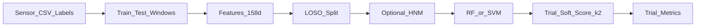

# FallDetection — 可穿戴惯性传感器跌倒检测

基于加速度 / 陀螺仪 / 欧拉角的**跌倒 vs 非跌倒**二分类。评估为 **LOSO**（Leave-One-Subject-Out），指标为 **trial 级**。

| 项 | 说明 |
|----|------|
| 数据 | SisFall 风格：受试者约 `S06`–`S38`，传感器 CSV + Excel 标签 |
| 评估 | LOSO ≈ 32 折；trial 级 Accuracy / Precision / Recall / F1 / AUC |
| 主模型 | **Random Forest**、**SVM**（Transformer 代码在，默认关闭） |
| **当前最佳** | **v2.3 RF_HNM**：`TEST_STRIDE=64`，`k=2` mean，`τ=0.46`，**Hard Negative Mining** |

**当前最佳指标（折均值，k=2 mean @ τ=0.46）**

| 模型 | Accuracy | Precision | Recall | F1 | AUC | 合计 FP / FN |
|------|----------|-----------|--------|-----|-----|--------------|
| **RandomForest** | **0.962** | **0.931** | **0.995** | **0.961** | **0.996** | **180 / 12** |
| SVM | 0.956 | 0.923 | 0.989 | 0.955 | 0.990 | 200 / 24 |

数据与细档见 [`output/v2.3/DEBUG.md`](output/v2.3/DEBUG.md)、[`output/v2.3/RF_HNM/`](output/v2.3/RF_HNM/)。

---

## 目录

1. [项目概览](#1-项目概览)
2. [技术设计](#2-技术设计)
3. [实验档案](#3-实验档案)
4. [设计决策](#4-设计决策)
5. [开发指南](#5-开发指南)

> **文档分工**：本 README 为总览与复现入口；版本细节见 `output/v*/HANDOFF.md`、`DEBUG.md`（`output/` 整体在 `.gitignore` 中，本地归档需自行保留）。

---

## 1. 项目概览

### 1.1 在做什么

从腰部/躯干可穿戴 IMU 序列中检测跌倒事件：每个 **trial**（一次动作录制）输出跌倒 / 非跌倒。窗级模型给出跌倒概率，再经软决策聚合成 trial 分数并与阈值比较。

### 1.2 文件结构

```
FallDetection/
├── main.py                 # 常规实验入口（RF + SVM；默认无 HNM）
├── config.py               # 路径、切窗、软决策 k/τ、HNM、超参网格
├── scripts/
│   ├── run_v23_hnm_alpha.py    # ★ 复现 v2.3：HNM 训练 + α/τ 扫描
│   └── sweep_svm_threshold.py  # SVM：训一次 → 离线扫 (k, τ)
├── preprocessing/
│   ├── reader.py           # 传感器 CSV + 标签 Excel
│   ├── dataset.py          # 合并 dataset dict
│   ├── window.py           # train/test 不同切窗
│   ├── feature.py          # 统计特征 → 约 158 维
│   └── data/               # 原始数据（.gitignore）
├── models/                 # Random_Forest / SVM / Transformer
├── utils/
│   ├── split.py            # LOSO
│   ├── sliding.py          # trial 软分数（mean / max+α·min）
│   ├── hnm.py              # Hard Negative Mining
│   ├── feature_cache.py    # joblib 特征缓存
│   ├── run.py / result.py  # 训练循环与结果写出
│   └── device.py
├── visualization/          # 数据 / 结果图
└── output/                 # .gitignore
    ├── Feature Dataset/    # 运行时特征缓存（须与 TEST_STRIDE 一致）
    ├── v1.0/ … v2.2/       # 历史归档
    └── v2.3/               # ★ 当前推荐：RF_HNM / SVM_HNM + α 扫描
```

### 1.3 数据集说明

- **风格**：SisFall 类公开跌倒数据集（本仓库为本地整理副本）。
- **受试者**：约 `S06`–`S38`（约 32 人进入 LOSO）。
- **文件**：每 trial 一份传感器 CSV；跌倒 onset/impact 与描述在 Excel 标签中。
- **采样率**：100 Hz（`config.SAMPLING_RATE`）。
- **通道**：AccX/Y/Z、GyrX/Y/Z、EulerX/Y/Z（9 维）。
- **动作编号（trial 名 `TxxRyy`）**：
  - Task **1–19、35、36**：非跌倒 ADL（走、上下楼、起坐、绊跌、跳跃等）
  - Task **20–34**：跌倒类型（对应标签中的 F01–F15 类描述）

跌倒类型映射见 `config.DESCRIPTION_MAP`。

---

## 2. 技术设计

### 2.1 端到端流程



### 2.2 数据处理（切窗）

| 模式 | 行为 |
|------|------|
| **train** | 跌倒：以 onset–impact 为中心裁剪后再滑窗；非跌倒：全序列均匀子采样，最多 `NON_FALL_MAX_WINDOWS=8` 窗 |
| **test** | 全序列滑窗，`TEST_STRIDE=64`（约 0.64 s @ 100 Hz） |

- 窗长 `WINDOW_SIZE=32`（约 0.32 s）。
- 训练步长 `TRAIN_STRIDE=32`；测试步长大于窗长 → 相邻测试窗不重叠，收益来自更密时间采样（相对 v2.1 的 stride=160）。

实现：[`preprocessing/window.py`](preprocessing/window.py)。

### 2.3 特征工程

对每个窗内各通道提取统计量（mean / std / max / min / range / peak-to-peak / RMS / variance / median / IQR / energy / skewness / kurtosis），并加入幅值类特征（acc/gyr/euler magnitude、SMA 等），合计约 **158 维**。

- 实现：[`preprocessing/feature.py`](preprocessing/feature.py)
- 缓存：`output/Feature Dataset/*.joblib`；改 `TEST_STRIDE` 等须设 `REBUILD_FEATURES=True` 重建

### 2.4 模型

| 模型 | 说明 |
|------|------|
| **Random Forest** | 固定网格 `{n_estimators: 100, max_depth: None}`；**当前最佳路径** |
| **SVM** | RBF；`C ∈ {10,100}`，`gamma ∈ {scale, 0.01}`；搜索时 `probability=False`，最优再开 |
| **Transformer** | 代码在 `models/Transformer.py`；`main.py` 中默认注释关闭 |

训练前对窗级样本做 **Random Under Sampling**（正负 1:1）。启用 HNM 时在 RUS 之后用 pilot 重采难负例（见下）。

### 2.5 设计机制

#### LOSO

- 每次留出一名受试者做 test；其余受试者再划 train / val（val 约 3 人）。
- 指标在 **trial** 上计算（一 trial 内窗概率 → 一个 trial 分数 → 一个预测）。
- 实现：[`utils/split.py`](utils/split.py)、[`utils/run.py`](utils/run.py)

#### Trial 平滑窗口概率决策

对时间排序后的窗概率序列 \(p_t\)：

- **默认（最佳方案）**：\(k=2\) 时  
  \(\mathrm{score}=\max_i \mathrm{mean}(p_i,p_{i+1})\)，  
  \(\hat{y}=1 \iff \mathrm{score}\ge\tau\)（当前 \(\tau=0.46\)）。
- **可选实验**：`score = max + α·min`（相邻两窗的 max/min；α 可为负）。F1 微调可用，**默认仍推荐 mean**。

实现：[`utils/sliding.py`](utils/sliding.py)。配置：`PROB_SMOOTH_SIZE`、`PROB_THRESHOLD`、`SCORE_AGG`、`SCORE_ALPHA`。

#### Hard Negative Mining（HNM）

针对高动态 ADL 误报（快走、上下楼、屈膝、跳跃/绊跌等）：

1. 在 **当前 train 折** 上 RUS 平衡 → 拟合 pilot（RF 或 SVM）
2. 对全部非跌倒窗：`mine_score = P(fall) + bonus · 1[hard ADL]`
3. 负例中约 `HNM_HARD_FRACTION=0.7` 取自最难样本，其余随机填满至与正例等量
4. 再网格搜索 / 训练终模型

Hard ADL Task：`(2, 5, 10, 15, 16, 18, 19, 35, 36)`。  
实现：[`utils/hnm.py`](utils/hnm.py)；开关：`config.ENABLE_HNM`（**默认 False**；v2.3 脚本运行时临时打开）。

---

## 3. 实验档案

| 版本 | 设定要点 | 关键结论 |
|------|----------|----------|
| **v1.0** | 窗级硬投票 → trial | 窗级尚可，trial 几乎全阴 |
| **v2.0** | 软决策，stride=160，τ≈0.50 | Recall 抬升，仍偏保守 |
| **v2.1** | stride=160，k=2，τ=0.35 | SVM Recall≈0.81；仍漏检约 19% |
| **v2.2** | stride=64，k=2，τ=0.46 | Recall 近饱和；短板转为 **Precision / 误报** |
| **v2.3** | + **HNM**（RF / SVM） | **RF_HNM 为当前最佳**；FP 约减半 |

### 对照（同为 k=2 mean @ τ=0.46）

| | v2.2 RF（无 HNM） | **v2.3 RF_HNM** | v2.3 SVM_HNM |
|--|------------------|-----------------|--------------|
| Precision | 0.843 | **0.931** | 0.923 |
| Recall | 0.999 | **0.995** | 0.989 |
| F1 | 0.912 | **0.961** | 0.955 |
| 合计 FP | ≈461 | **180** | 200 |

细档与图表：

- [`output/v2.3/DEBUG.md`](output/v2.3/DEBUG.md)
- [`output/v2.3/RF_HNM/`](output/v2.3/RF_HNM/)、[`RF_HNM_alpha_sweep/`](output/v2.3/RF_HNM_alpha_sweep/)
- 历史：`output/v1.0/` … `output/v2.2/`（含 HANDOFF / DEBUG）

---

## 4. 设计决策

1. **硬投票 → 软概率聚合**  
   v1.0 多数窗判阴导致 trial 分数被淹没；改为 `max(滑动均值)` 与校准 τ，窗级与 trial 级对齐。

2. **减小测试 stride，并上调 τ**  
   v2.1 漏检多为冲击附近采样过稀；`160→64` 抬高跌倒 trial 分数分布，必须同步把 τ 从 0.35 提到约 0.46，否则 Precision 崩溃。

3. **Precision 瓶颈用 HNM，而不是再减 stride**  
   误报集中在高动态 ADL（D02 快走、D05 上下楼、D15 屈膝等）；几何上已够密，继续加密主要加重非跌倒高分尾。HNM 抬决策边界，FP 明显下降，Recall 仍保持高位。

4. **`max+α·min` 仅作可选微调**  
   在 HNM 概率上，α≈0.25–0.5 可再抬 F1/Prec，但会牺牲部分 Recall；**负 α 不推荐**。产品默认仍：**mean @ τ=0.46**。

5. **同设定下选 RF_HNM**  
   v2.3 中 RF_HNM 的 Precision / F1 / AUC 略优于 SVM_HNM，训练与推理也更简单，故定为当前最佳。

---

## 5. 开发指南

### 5.1 环境

本机常用 conda 环境 `ml`，例如：

```powershell
cd D:\Data\VSCode\FallDetection
$env:PYTHONUNBUFFERED='1'
& 'c:\Users\Alextn\miniconda3\envs\ml\python.exe' -u ...
```

依赖包括：`numpy`、`pandas`、`scikit-learn`、`imbalanced-learn`、`scipy`、`joblib`、`matplotlib` 等（按 env 安装即可）。

### 5.2 复现当前最佳（v2.3 RF_HNM）

前提：

1. `output/Feature Dataset/` 为 **stride=64** 的特征缓存（可从 `output/v2.3/` 侧拷贝若你本地有归档）
2. `config.py`：`TEST_STRIDE=64`，`PROB_SMOOTH_SIZE=2`，`PROB_THRESHOLD=0.46`，`REBUILD_FEATURES=False`
3. HNM 由脚本在运行时打开（**不必**长期改默认；`ENABLE_HNM` 默认为 `False`）

```powershell
# 完整 LOSO 训练 + α/τ 扫描（仅 RF）
& 'c:\Users\Alextn\miniconda3\envs\ml\python.exe' -u scripts\run_v23_hnm_alpha.py --models rf

# 已有 trial_probs 缓存时只重扫阈值
& 'c:\Users\Alextn\miniconda3\envs\ml\python.exe' -u scripts\run_v23_hnm_alpha.py --models rf --reuse-probs

# 同时跑 RF + SVM
& 'c:\Users\Alextn\miniconda3\envs\ml\python.exe' -u scripts\run_v23_hnm_alpha.py --models svm rf
```

结果写入 `output/v2.3/RF_HNM/`、`output/v2.3/RF_HNM_alpha_sweep/`（脚本会归档）。

### 5.3 常规入口（无 HNM）

```powershell
& 'c:\Users\Alextn\miniconda3\envs\ml\python.exe' -u main.py
```

- 默认 RF + SVM，**不启用 HNM**
- 结果默认写在 **`output/` 根目录**（如 `output/Random Forest/`），**不会**自动进 `output/v2.3/`
- 改完实验请手动复制到 `output/v2.*/` 做版本归档

### 5.4 其它脚本

| 脚本 | 用途 |
|------|------|
| `scripts/sweep_svm_threshold.py` | 无 HNM 的 SVM：训一次 → 扫 (k, τ) |
| `scripts/run_v23_hnm_alpha.py` | 有 HNM 的 RF/SVM + `mean` / `max+α·min` 扫描 |

### 5.5 下一步计划

按优先级：

1. 难负 ADL 细化 / 损失或采样再加权（D02/D05/D15 等）
2. 高 FP 受试者（如历史上的 S07）自适应阈值或折内校准
3. 可选：将 Transformer 接到同一 trial 软决策与 LOSO 接口
4. **暂缓**：继续减小 `TEST_STRIDE`；盲目换模型

### 5.6 常见问题（FAQ）

**Q: 改了 `TEST_STRIDE` 结果异常？**  
A: 必须 `REBUILD_FEATURES=True` 重建测试特征；勿混用 v2.1（stride=160）与 v2.2/v2.3（stride=64）的 joblib。

**Q: 只改 τ / k / α 要重建特征吗？**  
A: 不必。用已有 `trial_probs` 或 `--reuse-probs` 离线重扫即可。

**Q: 为什么 `main.py` 跑出来没有 HNM 那么好的 Precision？**  
A: `config.ENABLE_HNM` 默认 `False`。复现最佳请用 `scripts/run_v23_hnm_alpha.py --models rf`。

**Q: 结果写到哪？为什么 git 里没有 output？**  
A: `output/` 在 `.gitignore` 中。默认写 `output/<Model>/`；版本归档需复制到 `output/v2.*/`。

**Q: HNM 会不会泄漏测试受试者？**  
A: 不会。Mining 只在当前 LOSO 折的 **train** 窗上进行。

**Q: `max+α·min` 要不要写进默认 config？**  
A: 当前不建议。默认保持 `SCORE_AGG=mean`、`τ=0.46`；α 扫描结果见 `output/v2.3/*_alpha_sweep/`。

---

## 参考归档索引

| 路径 | 内容 |
|------|------|
| `output/v2.3/DEBUG.md` | HNM + α 扫描结论 |
| `output/v2.3/RF_HNM/` | 当前最佳正式 LOSO |
| `output/v2.2/` | stride=64、无 HNM 基线 |
| `output/v2.1/` … `v1.0/` | 更早版本 HANDOFF / DEBUG |

*有冲突时以仓库当前代码与 `output/v2.3/RF_HNM/summary.csv` 为准。*
