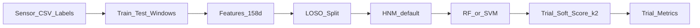

# FallDetection — 可穿戴惯性传感器跌倒检测

基于加速度、陀螺仪与欧拉角的**跌倒 / 非跌倒**二分类。评估协议为 **LOSO**（Leave-One-Subject-Out），指标在 **trial** 层级汇总。

| 项 | 说明 |
|----|------|
| 数据 | SisFall 风格本地整理集；受试者 `S06`–`S38`（32 人）；trial 共 5075（Fall 2346 / Normal 2729） |
| 评估 | LOSO 32 折；Accuracy / Precision / Recall / F1 / AUC（trial 级） |
| 主模型 | **Random Forest**、**SVM**（Transformer 实现保留，默认关闭） |
| **当前最佳** | **v2.3.1 Random Forest + HNM**：`TEST_STRIDE=64`，k=2 mean，τ=0.46 |

**当前最佳指标（折均值，HNM + k=2 mean @ τ=0.46；归档 `output/v2.3.1/`）**

| 模型 | Accuracy | Precision | Recall | F1 | AUC | 合计 FP / FN |
|------|----------|-----------|--------|-----|-----|--------------|
| **Random Forest** | **0.962** | **0.930** | **0.996** | **0.961** | **0.996** | **184 / 9** |
| SVM | 0.951 | 0.916 | 0.987 | 0.950 | 0.990 | 219 / 30 |

细档见 [`output/v2.3.1/DEBUG.md`](output/v2.3.1/DEBUG.md)、[`output/v2.3.1/Random Forest/`](output/v2.3.1/Random%20Forest/)。历史对照见 [`output/v2.3/`](output/v2.3/)、[`output/v2.2/`](output/v2.2/)。

---

## 目录

1. [项目概览](#1-项目概览)
2. [技术设计](#2-技术设计)
3. [实验档案](#3-实验档案)
4. [设计决策](#4-设计决策)
5. [开发指南](#5-开发指南)

> **文档分工**：本 README 为总览与复现入口；版本细节见 `output/v*/HANDOFF.md`、`DEBUG.md`（`output/` 整体在 `.gitignore` 中，本地归档需自行保留）。

---

## 1. 项目概览

### 1.1 任务定义

本工作从腰部 / 躯干可穿戴 IMU 序列中识别跌倒事件。每个 **trial**（一次完整动作录制）对应一个二值标签。模型首先在滑动窗上输出跌倒概率，再经时间平滑与阈值判决聚合为 trial 级预测。

### 1.2 文件结构

```
FallDetection/
├── main.py                 # 常规实验入口（RF + SVM；默认启用 HNM）
├── config.py               # 路径、切窗、软决策 k/τ、HNM、超参网格
├── scripts/
│   ├── run_hnm_alpha_k.py      # HNM 训练 + α/k 扫描 → 归档 output/v2.3.1/
│   └── sweep_svm_threshold.py  # SVM：训一次 → 离线扫 (k, τ)
├── preprocessing/
│   ├── reader.py           # 传感器 CSV + 标签 Excel
│   ├── dataset.py          # 合并 dataset dict
│   ├── window.py           # train/test 不同切窗
│   ├── feature.py          # 统计特征 → 约 158 维
│   └── data/               # 原始数据（.gitignore）
├── models/                 # Random_Forest / SVM / Transformer
├── utils/
│   ├── split.py            # LOSO
│   ├── sliding.py          # trial 软分数（mean / max+α·min）
│   ├── hnm.py              # Hard Negative Mining
│   ├── feature_cache.py    # joblib 特征缓存
│   ├── run.py / result.py  # 训练循环与结果写出
│   └── device.py
├── visualization/          # 数据 mean±std 带；结果 CM / ROC / LOSO-PRF
└── output/                 # .gitignore
    ├── Feature Dataset/    # 运行时特征缓存（须与 TEST_STRIDE 一致）
    ├── Random Forest/      # main 写出的正式 LOSO（含 HNM）
    ├── SVM/
    ├── figures/
    │   ├── data/           # fall_vs_normal_meanstd.png
    │   └── results/<Model>/  # confusion_matrix / roc_curve / loso_prf
    ├── v1.0/ … v2.3/       # 历史归档（v2.3 含 RF_HNM 等旧名）
    └── v2.3.1/             # ★ 当前推荐归档（Random Forest / SVM + α 扫描）
```

### 1.3 数据集说明

- **来源风格**：SisFall 类公开跌倒数据集的本地整理副本。
- **受试者**：`S06`–`S38`，共 **32** 人进入 LOSO。
- **类别分布（trial 级）**：

| 类别 | 数量 | 占比 |
|------|------|------|
| Fall | **2346** | 46.2% |
| Normal（ADL） | **2729** | 53.8% |
| **合计** | **5075** | 100% |

- **文件组织**：每 trial 对应一份传感器 CSV；跌倒 onset / impact 与文字描述记录于 Excel 标签。
- **采样率**：100 Hz（`config.SAMPLING_RATE`）。
- **通道**：AccX/Y/Z、GyrX/Y/Z、EulerX/Y/Z（9 维）。
- **动作编号（trial 名 `TxxRyy`）**：
  - Task **1–19、35、36**：非跌倒 ADL（行走、上下楼、起坐、绊跌、跳跃等）
  - Task **20–34**：跌倒类型（对应标签中的 F01–F15 类描述）

跌倒类型到编号的映射见 `config.DESCRIPTION_MAP`。

---

## 2. 技术设计

### 2.1 端到端流程



### 2.2 数据处理（切窗）

| 模式 | 行为 |
|------|------|
| **train** | 跌倒：以 onset–impact 为中心裁剪后再滑窗；非跌倒：全序列均匀子采样，最多 `NON_FALL_MAX_WINDOWS=8` 窗 |
| **test** | 全序列滑窗，`TEST_STRIDE=64`（约 0.64 s @ 100 Hz） |

- 窗长 `WINDOW_SIZE=32`（约 0.32 s）。
- 训练步长 `TRAIN_STRIDE=32`；测试步长大于窗长，相邻测试窗不重叠；相对 v2.1（stride=160）的收益主要来自更密的时间采样。

实现：[`preprocessing/window.py`](preprocessing/window.py)。

### 2.3 特征工程

对每个窗内各通道提取统计量（mean / std / max / min / range / peak-to-peak / RMS / variance / median / IQR / energy / skewness / kurtosis），并加入幅值类特征（acc / gyr / euler magnitude、SMA 等），合计约 **158** 维。

- 实现：[`preprocessing/feature.py`](preprocessing/feature.py)
- 缓存：`output/Feature Dataset/*.joblib`；修改 `TEST_STRIDE` 等须设 `REBUILD_FEATURES=True` 重建

### 2.4 模型

| 模型 | 说明 |
|------|------|
| **Random Forest** | 固定网格 `{n_estimators: 100, max_depth: None}`；**当前最佳路径** |
| **SVM** | RBF；`C ∈ {10,100}`，`gamma ∈ {scale, 0.01}`；搜索时 `probability=False`，最优参数再开概率估计 |
| **Transformer** | 实现位于 `models/Transformer.py`；`main.py` 中默认注释关闭 |

训练前对窗级样本执行 **Random Under Sampling**（正负 1:1）。启用 HNM 时，在 RUS 之后以 pilot 模型重采难负例（见下）。

### 2.5 设计机制

#### LOSO

- 每次留出一名受试者作为 test；其余受试者再划分为 train / val（val 约 3 人）。
- 全部指标在 **trial** 上计算：一 trial 内窗概率 → 一个 trial 分数 → 一个预测标签。
- 实现：[`utils/split.py`](utils/split.py)、[`utils/run.py`](utils/run.py)

#### Trial 平滑窗口概率决策

对时间排序后的窗概率序列 \(p_t\)：

- **默认（正式路径）**：\(k=2\) 时  
  \(\mathrm{score}=\max_i \mathrm{mean}(p_i,p_{i+1})\)，  
  \(\hat{y}=1 \iff \mathrm{score}\ge\tau\)（当前 \(\tau=0.46\)）。
- **可选离线档**：`score = max + α·min`（相邻两窗的 max / min；α 可为负）。可用于 F1 / Precision 微调，**默认仍采用 mean**。

实现：[`utils/sliding.py`](utils/sliding.py)。配置项：`PROB_SMOOTH_SIZE`、`PROB_THRESHOLD`、`SCORE_AGG`、`SCORE_ALPHA`。

#### Hard Negative Mining（HNM）

针对高动态 ADL 误报（快走、上下楼、屈膝、跳跃 / 绊跌等）：

1. 在当前 LOSO 折的 **train** 窗上 RUS 平衡后拟合 pilot（RF 或 SVM）；
2. 对全部非跌倒窗计算 `mine_score = P(fall) + bonus · 1[hard ADL]`；
3. 负例中约 `HNM_HARD_FRACTION=0.7` 取自最难样本，其余随机补齐至与正例等量；
4. 再进行网格搜索 / 训练终模型。

Hard ADL Task：`(2, 5, 10, 15, 16, 18, 19, 35, 36)`。  
实现：[`utils/hnm.py`](utils/hnm.py)；开关：`config.ENABLE_HNM`（**默认 True**）。

#### 可视化

- 数据：跌倒按 onset、正常按序列中心对齐后的 Acc / Gyr / Euler 幅值 **mean±std 带** → `output/figures/data/`
- 结果：混淆矩阵、ROC、LOSO 折上 Precision / Recall / F1 → `output/figures/results/<Model>/`

---

## 3. 实验档案

| 版本 | 设定要点 | 关键结论 |
|------|----------|----------|
| **v1.0** | 窗级硬投票聚合为 trial | 窗级表现尚可，trial 级几乎全阴 |
| **v2.0** | 软决策，stride=160，τ≈0.50 | Recall 抬升，整体仍偏保守 |
| **v2.1** | stride=160，k=2，τ=0.35 | SVM Recall≈0.81；仍漏检约 19% |
| **v2.2** | stride=64，k=2，τ=0.46 | Recall 近饱和；短板转为 **Precision / 误报** |
| **v2.3** | + HNM（RF / SVM；旧目录名 `*_HNM`） | FP 约减半；确立 HNM 路径 |
| **v2.3.1** | 命名统一为 Random Forest / SVM；α/k 扫描脚本 | **当前推荐归档**；指标与结论以本版为准 |

### 对照 A：正式路径（同为 k=2 mean @ τ=0.46）

| | v2.2 RF（无 HNM） | **v2.3.1 RF + HNM** | v2.3.1 SVM + HNM |
|--|------------------|---------------------|------------------|
| Precision | 0.843 | **0.930** | 0.916 |
| Recall | 0.999 | **0.996** | 0.987 |
| F1 | 0.912 | **0.961** | 0.950 |
| 合计 FP / FN | ≈461 / 3 | **184 / 9** | 219 / 30 |

### 对照 B：离线 F1 优先（`max+α·min`，未写入默认 config）

| | **RF** α=0.25, τ=0.86 | SVM α=0.75, τ=1.0 |
|--|------------------------|---------------------|
| Precision | **0.978** | 0.952 |
| Recall | **0.979** | 0.975 |
| F1 | **0.979** | 0.963 |
| 合计 FP / FN | **54 / 48** | 117 / 59 |

细档与图表：

- 当前：[`output/v2.3.1/DEBUG.md`](output/v2.3.1/DEBUG.md)、[`Random Forest/`](output/v2.3.1/Random%20Forest/)、[`*_alpha_sweep/`](output/v2.3.1/Random_Forest_alpha_sweep/)
- 历史：`output/v2.3/`（含 `RF_HNM` 旧名）、`output/v1.0/` … `output/v2.2/`（含 HANDOFF / DEBUG）

---

## 4. 设计决策

本节按「发现问题 → 提出机制 → 给出实现 → 实验证明 → 分析原因」组织。事实与主体框架不变，表述对齐论文叙事。

### 4.1 由窗级硬投票转向 trial 级软概率聚合

**发现问题。**  
v1.0 将窗级硬标签多数表决为 trial 决策。由于跌倒冲击在全序列中仅占少数窗，多数窗被标为非跌倒，trial 分数被淹没，出现「窗级尚可、trial 几乎全阴」的失效模式。

**提出机制。**  
保留窗级概率，在时间轴上做短窗平滑，并以平滑序列的峰值作为 trial 分数，再与阈值比较，使 trial 决策与冲击局部证据对齐。

**给出实现。**  
对排序后的 \(p_t\) 取 \(k=2\) 滑动均值，再取 \(\mathrm{score}=\max_i\mathrm{mean}(p_i,p_{i+1})\)，\(\hat{y}=\mathbf{1}[\mathrm{score}\ge\tau]\)（[`utils/sliding.py`](utils/sliding.py)）。

**实验证明。**  
引入软决策后（v2.0 及后续），Recall 相对 v1.0 显著抬升，trial 级评估恢复可解释性。

**分析原因。**  
跌倒信息集中于 onset–impact 邻域；max-of-smoothed-mean 放大局部高响应，避免被长序列中的负窗稀释。

### 4.2 加密测试采样并重标定阈值

**发现问题。**  
v2.1（`TEST_STRIDE=160`，τ=0.35）下 SVM Recall 约 0.81，仍漏检约 19%。漏检 trial 的窗级 `max(p)` 中位偏低，提示冲击邻域采样过稀，而非单纯阈值偏高。

**提出机制。**  
减小测试步长以增加冲击附近的观测密度；分数整体上移后，必须同步上调 τ，否则非跌倒高分尾将导致 Precision 崩溃。

**给出实现。**  
`TEST_STRIDE: 160→64`，重建测试特征；以 Prec≥0.85 约束下 Recall 优先规则重扫 `(k,τ)`，选定 **k=2，τ=0.46** 写入 config（见 `output/v2.2/DEBUG.md`）。

**实验证明。**  
v2.2 中 RF / SVM Recall 分别约 0.999 / 0.997，FN 大幅下降；同设定下 F1 明显优于 v2.1。

**分析原因。**  
更密的非重叠窗提高了冲击被覆盖的概率，抬高跌倒 trial 分数分布；τ 由 0.35 调至 0.46，抵消双侧分数上移带来的假阳性膨胀。

### 4.3 以 Hard Negative Mining 针对 Precision 瓶颈

**发现问题。**  
v2.2 召回近饱和后，剩余误差以假阳性为主（RF 合计 FP≈461）。误报集中于高动态 ADL，继续减小 stride 主要加重非跌倒高分尾，边际收益有限。

**提出机制。**  
在折内训练集上，用 pilot 识别「易被判为跌倒」的负窗，并提高其在负例池中的占比，迫使终模型边界远离难负例，同时保留部分随机负例以免过拟合极端 ADL。

**给出实现。**  
RUS → pilot → `mine_score = P(fall) + 0.15·1[hard ADL]` → 负例中 70% 取最难样本（[`utils/hnm.py`](utils/hnm.py)）；Hard ADL Task 为 `(2,5,10,15,16,18,19,35,36)`。正式判决仍固定为 mean @ τ=0.46，以便与 v2.2 做同判决对照。

**实验证明。**  
v2.3.1 相对 v2.2：RF Precision 0.843→0.930，FP 461→184（约 −60%），Recall 仅由 0.999 降至 0.996；SVM 呈同方向、幅度略小的改善。

**分析原因。**  
Precision 瓶颈源于决策边界对高动态 ADL 不够保守。HNM 改变负例构成而不改测试几何，故能在几乎不牺牲召回的前提下压缩 FP；mining 仅使用当前折 train 窗，无测试受试者泄漏。

### 4.4 将 `max+α·min` 保留为离线可选档

**发现问题。**  
在 HNM 概率上，仍存在「能否用更紧的聚合进一步抬 F1 / Precision」的问题；若直接改写默认判决，将破坏与 v2.2 的可比性，并可能牺牲召回。

**提出机制。**  
在缓存的 trial 概率上离线扫描 `score=max+α·min` 与 \((k,\tau)\)，按 F1 优先或 Prec 约束选点，仅作为可选工作点，不进入默认 config。

**给出实现。**  
[`scripts/run_hnm_alpha_k.py`](scripts/run_hnm_alpha_k.py) 在 `--reuse-probs` 下读取 `SCORE_ALPHA_RANGE` / `SCORE_K` 扫描；结果写入 `output/v2.3.1/*_alpha_sweep/`。

**实验证明。**  
F1 优先下，RF 取 α=0.25、τ=0.86 时 F1≈0.979、FP=54；SVM 取 α=0.75、τ=1.0 时 F1≈0.963。相对 mean@0.46，F1 / Precision 上升，Recall 与 FN 有所恶化。

**分析原因。**  
`max+α·min` 与更高 τ 收紧边界，抑制非跌倒高分尾，故误报下降、F1 提高；漏检增加表明该档更适「少误报」场景。负 α 在扫描中不具稳定优势，不推荐。默认路径仍取 **mean @ τ=0.46** 以优先保障召回与跨版本对照。

### 4.5 同设定下选择 Random Forest 作为主模型

**发现问题。**  
RF 与 SVM 在相同切窗、特征、HNM 与判决协议下均可用，需明确主路径以免结论分散。

**提出机制。**  
在同一评估协议下比较折均值指标、池化 FP/FN 以及训练 / 推理复杂度，选择综合更优且实现更简单的模型。

**给出实现。**  
两模型共享 `run_hnm_alpha_k.py` / `main.py` 管线；RF 网格固定为 `n_estimators=100, max_depth=None`；SVM 折内搜索 `C` 与 `gamma`。

**实验证明。**  
正式路径（mean@0.46）下 RF 在 Accuracy、Precision、Recall、F1、AUC 及 FP/FN 上均优于 SVM；F1 优先离线档下 RF（F1≈0.979）亦优于 SVM（≈0.963）。

**分析原因。**  
在当前 158 维统计特征与难负重采样设定下，RF 对高动态 ADL 边界更稳健，且无需逐折核超参搜索，复现成本更低，故定为当前最佳路径。

---

## 5. 开发指南

### 5.1 环境

本机常用 conda 环境 `ml`，例如：

```powershell
cd D:\Data\VSCode\FallDetection
$env:PYTHONUNBUFFERED='1'
& 'c:\Users\Alextn\miniconda3\envs\ml\python.exe' -u ...
```

依赖包括：`numpy`、`pandas`、`scikit-learn`、`imbalanced-learn`、`scipy`、`joblib`、`matplotlib` 等。

### 5.2 常规入口

```powershell
& 'c:\Users\Alextn\miniconda3\envs\ml\python.exe' -u main.py
```

- 默认训练 RF + SVM，**`ENABLE_HNM=True`**
- 结果写入 **`output/Random Forest/`**、**`output/SVM/`**，图写入 **`output/figures/`**
- 不会自动进入 `output/v2.3.1/`；版本归档请手动复制，或使用下方脚本

### 5.3 复现 / α·k 扫描并归档（v2.3.1）

前提：

1. `output/Feature Dataset/` 为 **stride=64** 的特征缓存  
2. `config.py`：`TEST_STRIDE=64`，`PROB_SMOOTH_SIZE=2`，`PROB_THRESHOLD=0.46`，`REBUILD_FEATURES=False`

```powershell
# 完整 LOSO 训练 + α/τ 扫描（仅 RF）
& 'c:\Users\Alextn\miniconda3\envs\ml\python.exe' -u scripts\run_hnm_alpha_k.py --models rf

# 已有 trial_probs 缓存时只重扫阈值
& 'c:\Users\Alextn\miniconda3\envs\ml\python.exe' -u scripts\run_hnm_alpha_k.py --models rf --reuse-probs

# 同时跑 RF + SVM
& 'c:\Users\Alextn\miniconda3\envs\ml\python.exe' -u scripts\run_hnm_alpha_k.py --models svm rf
```

结果写入 `output/v2.3.1/Random Forest/`、`output/v2.3.1/Random_Forest_alpha_sweep/`。

### 5.4 其它脚本

| 脚本 | 用途 |
|------|------|
| `scripts/sweep_svm_threshold.py` | 无 HNM 的 SVM：训一次后扫 (k, τ) |
| `scripts/run_hnm_alpha_k.py` | RF/SVM + HNM + mean / `max+α·min` 扫描，归档至 **v2.3.1** |

### 5.5 下一步计划

按优先级：

1. 难负 ADL 细化 / 损失或采样再加权（D02 / D05 / D15 等）  
2. 高 FP 受试者（如历史上的 S07）自适应阈值或折内校准  
3. 可选：将 Transformer 接入同一 trial 软决策与 LOSO 接口  
4. **暂缓**：继续减小 `TEST_STRIDE`；盲目更换模型族

### 5.6 常见问题（FAQ）

**Q: 修改 `TEST_STRIDE` 后结果异常？**  
A: 须设 `REBUILD_FEATURES=True` 重建测试特征；勿混用 v2.1（stride=160）与 v2.2 / v2.3.1（stride=64）的 joblib。

**Q: 仅修改 τ / k / α 是否需要重建特征？**  
A: 不需要。可基于已有 `trial_probs` 或 `--reuse-probs` 离线重扫。

**Q: 如何关闭 HNM？**  
A: 设置 `config.ENABLE_HNM = False`。当前默认开启。

**Q: 结果写到何处？为何 git 中看不到 output？**  
A: `output/` 已在 `.gitignore` 中。默认写入 `output/<Model>/`；版本归档请复制到 `output/v2.*/` 或运行 `run_hnm_alpha_k.py`（→ `v2.3.1/`）。

**Q: HNM 是否泄漏测试受试者？**  
A: 否。Mining 仅在当前 LOSO 折的 **train** 窗上进行。

**Q: 是否应将 `max+α·min` 写入默认 config？**  
A: 当前不建议。默认保持 `SCORE_AGG=mean`、`τ=0.46`；α 扫描结果见 `output/v2.3.1/*_alpha_sweep/`。

---

## 参考归档索引

| 路径 | 内容 |
|------|------|
| `output/v2.3.1/DEBUG.md` | 当前结论：问题动机、HNM 证据、F1 优先对比 |
| `output/v2.3.1/Random Forest/` | 当前最佳正式 LOSO |
| `output/v2.3/` | 历史 HNM 归档（旧命名保留） |
| `output/v2.2/` | stride=64、无 HNM 基线 |
| `output/v2.1/` … `v1.0/` | 更早版本 HANDOFF / DEBUG |

*有冲突时以仓库当前代码与 `output/v2.3.1/Random Forest/summary.csv` 为准。*
